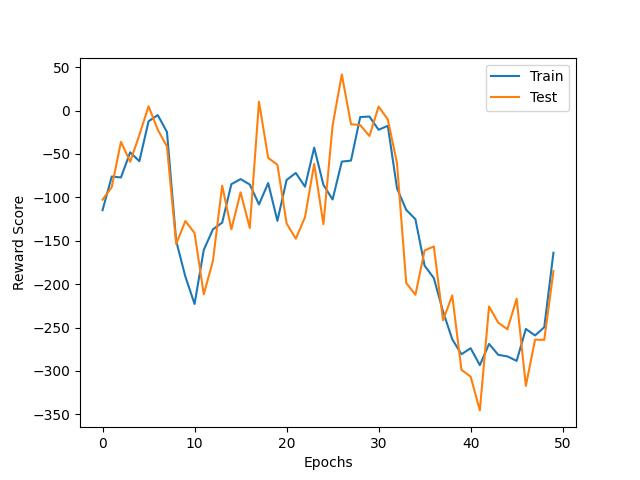
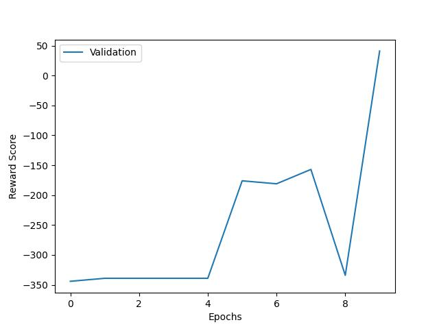
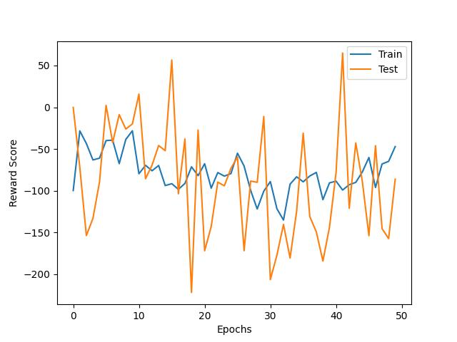

<div align="center">

# <b>Optimizing Value-Based Reinforcement Learning using DQN</b>

</div>

In this project, we compare the performance of two different architectures of deep Q-networks (DQNs) for value-based reinforcement learning, i.e. **DQN** and **Duel DQN** in the context of ViZDoom game environment.


## Introduction

Reinforcement learning is a process in which an agent interacts with an environment to learn how to make decisions. Value-based reinforcement learning involves estimating the value of actions in a given state to maximize rewards. The deep Q-network algorithm combines deep learning and reinforcement learning to approximate the Q-value function, which is the expected cumulative reward for taking a specific action in a given state.

## Architecture

The DQN architecture uses a single neural network to approximate the Q-value function. It takes the current state of the environment as input and outputs the estimated Q-values for all possible actions in that state. The agent selects the action with the highest Q-value to maximize its rewards.

<div align="center"><image width="400" src="./images/dqn.png"></div>

The Duel DQN architecture is an extension of the DQN architecture that separates the estimation of the state value and action advantage functions. It uses two parallel neural networks: one estimates the state value function, which measures the value of being in a particular state regardless of the action taken, and the other estimates the action advantage function, which measures the advantage of taking a particular action in a particular state over other possible actions. The Q-value function is then computed as the sum of the state value and action advantage functions.
<div align="center"><image width="400" src="./images/ddqn.png"></div>

## Results

To compare the performance of the two architectures, we train agents using both DQN and Duel DQN on the ViZDoom game
environment. We monitor the learning process and performance of the agents using mean reward per episode on both training
and testing game episodes.

### Optimal Hyperparameters

| Hyperparameter | Value |
|----------------|-------|
| **Learning Rate** | 0.007 |
| **Batch Size** | 128 |
| **Replay Memory Size** | 10000 |
| **Discount Factor** | 0.88 |
| **Frame Repeat** | 12 |
| **Epsilon Decay** | 0.99 |

<br>

### DQN

<br>

Train + Test Reward Scores | Validation Reward Scores |
:-------------------------:|:-------------------------:
  |  

### Double DQN

<br>

Train + Test Reward Scores | Validation Reward Scores |
:-------------------------:|:-------------------------:
  |  


### Dueling DQN

<br>

| Train + Test Reward Scores (**Baseline**) | Train + Test Reward Scores (**Optimized**) | Validation Reward Scores |
:---------:|:-------------------------:|:-------------------------:
 |   |  


## Conclusion

The results show that the Duel DQN architecture outperforms the DQN architecture in terms of learning speed and
final performance. **The Duel DQN agent is able to achieve a higher score in the game environment and learns a more
optimal policy faster than the DQN agent.** This is primarily due to the separation of the state value and action advantage
functions, which helps to reduce overestimation of the Q-values and improve the stability of the learning process.

## Project Structure

| File/Directory | Description |
|----------------|-------------|
| `agents`       | DQN, Double DQN and Duel DQN agent implementations  |
| `checkpoints`  | Saved model files  |
| `config`       | W&B Sweep Configuration  |
| `out`          | Execution log files |
| `images`       | Concept diagrams/images  |
| `models`       | DQN and Duel DQN model implementations |
| `notebooks`    | Relevant jupyter notebooks |
| `plots`        | Plots for train and test reward scores |
| `scenarios`    | ViZDoom game scenario configuration files |
| `scripts`      | Slurm scripts |
| `main.py`      | Entry point (Training and Testing) the agent |
| `sweep.py`     | W&B Agent entry point |

## Usage

To run the code, follow these steps:

1. Clone the repository
    ```bash
    git clone git@github.com:utsavoza/fuzzy-enigma.git
    ```

2. Setup and activate the virtual environment
    ```bash
    python3 -m venv .
    source ./bin/activate
    ```

3. Install the required dependencies
    ```bash
    pip install -r requirements.txt
    ```

4. Configure and train the DQN agent with different set of hyperparams
    ```bash
    python main.py --batch-size=64 --lr=0.00025 --discount-factor=0.99 --num-epochs=50 --memory-size=10000
    ```

5. See the trained DQN agent in action
    ```bash
    python main.py --load-model=True --checkpoints='duel' --skip-training=True
    ```

## References

- [Dueling Network Architectures for Deep Reinforcement Learning](https://arxiv.org/pdf/1511.06581.pdf)

## License

The project is licensed under MIT license. See [LICENCE](./LICENSE).
